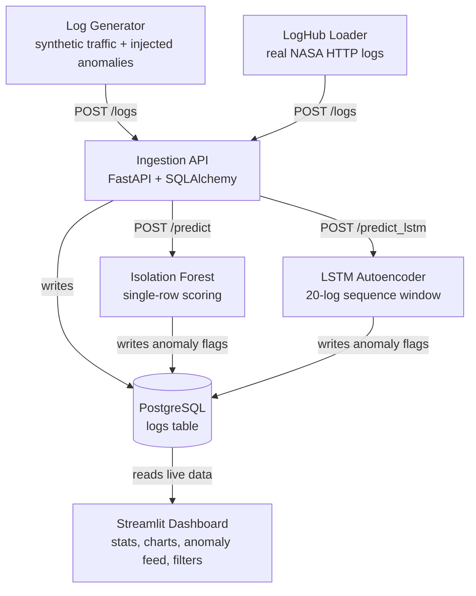

# Log Analysis Dashboard with Anomaly Detection

An end-to-end system that generates, ingests, stores, and analyzes application logs in real time — using two complementary machine learning models to automatically flag anomalous behavior (traffic spikes, server errors, suspicious IP activity) on a live dashboard.

Built as a learning project with a focus on measuring and improving real system behavior, not just wiring components together — see [Evaluation Results](#evaluation-results) below for a concrete before/after comparison of a real train/serve skew bug that was found and fixed.

## Architecture



Every service runs in its own Docker container, orchestrated with Docker Compose. Both ML models run inside the same `ml` service, sharing a single feature-engineering module (`ml/features.py`) so that training and serving always compute features identically — this was a real bug found and fixed during development (see below).

## Tech Stack

| Layer | Tool |
|---|---|
| Log generation | Python, Faker, real NASA HTTP access logs (LogHub) |
| Ingestion API | FastAPI, SQLAlchemy |
| Database | PostgreSQL |
| ML — point anomalies | scikit-learn (Isolation Forest) |
| ML — sequential anomalies | PyTorch (LSTM Autoencoder) |
| Dashboard | Streamlit |
| Containers | Docker, Docker Compose |
| CI | GitHub Actions |

## Features

- Two interchangeable log sources: a synthetic generator (Faker, with injected traffic spikes, repeated errors, and IP hammering) and a real-world loader for the [NASA HTTP access log dataset](https://ita.ee.lbl.gov/html/contrib/NASA-HTTP.html) (LogHub), toggled via `LOG_SOURCE` env var
- FastAPI ingestion service storing logs in PostgreSQL, scoring every log with **both** models in real time
- **Isolation Forest** — trained on response time, status code, and a 60-second time-windowed per-IP request count, for fast single-row anomaly scoring
- **LSTM Autoencoder** — trained on 20-log sliding windows in chronological order, for detecting sequential/temporal patterns (e.g. traffic ramp-ups) that a row-by-row model structurally cannot see
- A repeatable evaluation harness (`generator/eval_run.py` + `ml/evaluate.py`) that sends a controlled batch of known-labeled normal/anomalous logs and computes precision, recall, F1, and a confusion matrix for both models against ground truth
- Real-time Streamlit dashboard with live summary stats, log volume/status code charts, live anomaly feed, and sidebar filters
- Fully Dockerized — one command runs the entire pipeline
- GitHub Actions CI for basic build validation

## Evaluation Results

Both models are evaluated against a controlled batch of known-labeled anomalies (repeated server errors, IP hammering bursts) injected alongside normal traffic:

| Metric | Isolation Forest | LSTM Autoencoder |
|---|---|---|
| Precision | 0.957 | 0.679 |
| Recall | 0.319 | **0.797** |
| F1 score | 0.478 | **0.733** |

**Takeaway:** Isolation Forest is conservative — it's rarely wrong when it flags something (95.7% precision), but misses roughly 2 out of every 3 real anomalies. The LSTM catches significantly more real anomalies (79.7% recall, ~2.5x better) by using sequential context instead of scoring each log in isolation, at the cost of more false positives. Which model is preferable depends on the operational trade-off between missed incidents and alert fatigue — in practice, a combination (e.g. LSTM for alerting, Isolation Forest for high-confidence auto-triage) is likely the best of both.

### A real bug found via evaluation

The Isolation Forest's initial recall was **0.174** — far worse than the 0.319 shown above. Root cause: the model was trained on an **all-time cumulative** per-IP request count, but served on a count computed incrementally as each log arrived — a classic train/serve skew. Fixing this (switching both training and serving to the same 60-second time-windowed count, in a shared `ml/features.py` module) nearly doubled recall (0.174 → 0.348) and eliminated a second bug where all logs with a missing `response_time_ms` (i.e. every real-world NASA log row) silently failed to score at all.

## How to Run

```bash
git clone https://github.com/KayTheCoder-101/log-anomaly-dashboard.git
cd log-anomaly-dashboard
docker-compose up --build
```

Then open:
- Dashboard: http://localhost:8501
- Ingestion API docs: http://localhost:8000/docs
- ML scoring API docs: http://localhost:8001/docs

### Running with real data instead of synthetic

```bash
mkdir -p data/raw
curl -o data/raw/NASA_access_log_Jul95.gz https://ita.ee.lbl.gov/traces/NASA_access_log_Jul95.gz
gunzip data/raw/NASA_access_log_Jul95.gz
docker-compose run -e LOG_SOURCE=loghub generator
```

### Running the evaluation harness

```bash
docker-compose run -e GROUND_TRUTH_PATH=/data/ground_truth.jsonl generator python3 eval_run.py
docker-compose run -e GROUND_TRUTH_PATH=/data/ground_truth.jsonl ml python3 evaluate.py
```

### Retraining either model

```bash
docker-compose run ml python3 train.py        # Isolation Forest
docker-compose run ml python3 train_lstm.py   # LSTM Autoencoder
docker-compose restart ml
```

## Screenshots

**Dashboard Overview**


**Live Anomaly Feed**


## Database Schema

```sql
CREATE TABLE logs (
    id SERIAL PRIMARY KEY,
    timestamp TIMESTAMP NOT NULL,
    source_ip VARCHAR(45) NOT NULL,
    endpoint VARCHAR(255) NOT NULL,
    method VARCHAR(10) NOT NULL,
    status_code INT NOT NULL,
    response_time_ms FLOAT,
    bytes_sent INT NOT NULL,
    user_agent TEXT,
    is_anomaly BOOLEAN DEFAULT NULL,
    anomaly_score FLOAT DEFAULT NULL,
    lstm_is_anomaly BOOLEAN DEFAULT NULL,
    lstm_anomaly_score FLOAT DEFAULT NULL,
    created_at TIMESTAMP DEFAULT NOW()
);
```

`response_time_ms` is nullable to accommodate real-world log sources (like NASA HTTP logs) that don't report it; both models handle this explicitly via a `has_response_time` feature flag plus median imputation, rather than silently failing or faking a value.

## Known Limitations

- Single-node deployment; no horizontal scaling yet
- No authentication on the dashboard or APIs
- No alerting on detected anomalies (email/Slack)
- LSTM windowing recomputes per-IP request counts on every prediction, which is correctness-first but not optimized for high-throughput serving

## Future Improvements

- Add authentication and alerting (email/Slack on anomaly detection)
- Swap Streamlit for a custom React dashboard for more UI control, consuming a clean API layer instead of hitting Postgres directly
- Add Kubernetes deployment configs, with horizontal scaling specifically for the ingestion and ML services
- Optimize LSTM serving-time feature computation (e.g. a rolling cache instead of recomputing per-window)
- Explore an ensemble approach that combines both models' scores rather than reporting them independently
