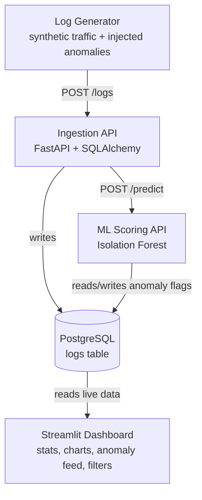

# Log Analysis Dashboard with Anomaly Detection

An end-to-end system that generates, ingests, stores, and analyzes application logs in real time — using machine learning to automatically flag anomalous behavior (traffic spikes, server errors, suspicious IP activity) on a live dashboard.

## Architecture



Every service above runs in its own Docker container, orchestrated with Docker Compose. The dashboard is set to auto-restart on failure, so the system stays available even if one component crashes.

## Tech Stack

| Layer | Tool |
|---|---|
| Log generation | Python, Faker |
| Ingestion API | FastAPI, SQLAlchemy |
| Database | PostgreSQL |
| ML | scikit-learn (Isolation Forest) |
| Dashboard | Streamlit |
| Containers | Docker, Docker Compose |
| CI | GitHub Actions |

## Features

- Synthetic log generator that simulates realistic traffic plus injected anomalies (traffic spikes, repeated server errors, IP hammering)
- FastAPI ingestion service storing logs in PostgreSQL
- Isolation Forest model trained on response time, status code, and request frequency to flag anomalies automatically
- Real-time Streamlit dashboard with:
  - Live summary stats (total logs, anomaly count, anomaly rate)
  - Log volume and status code charts
  - Live anomaly feed
  - Sidebar filters (status code, endpoint, anomaly-only view)
- Fully Dockerized — one command runs the entire pipeline
- GitHub Actions CI for basic build validation

## Demo

*(add a link to your demo video here — e.g. a LinkedIn post, YouTube upload, or a GIF embedded directly)*

## How to Run

```bash
git clone https://github.com/KayTheCoder-101/log-anomaly-dashboard.git
cd log-anomaly-dashboard
docker-compose up --build
```

Then open:
- Dashboard: http://localhost:8501
- Ingestion API docs: http://localhost:8000/docs
- ML scoring API docs: http://localhost:8001/docs

## Screenshots

**Dashboard Overview**


**Live Anomaly Feed**


## Database Schema

```sql
CREATE TABLE logs (
    id SERIAL PRIMARY KEY,
    timestamp TIMESTAMP NOT NULL,
    source_ip VARCHAR(45) NOT NULL,
    endpoint VARCHAR(255) NOT NULL,
    method VARCHAR(10) NOT NULL,
    status_code INT NOT NULL,
    response_time_ms FLOAT NOT NULL,
    bytes_sent INT NOT NULL,
    user_agent TEXT,
    is_anomaly BOOLEAN DEFAULT NULL,
    anomaly_score FLOAT DEFAULT NULL,
    created_at TIMESTAMP DEFAULT NOW()
);
```

## Known Limitations

- Runs on synthetically generated log data (via Faker), not real production traffic
- Isolation Forest is a relatively simple anomaly detection model — see Future Improvements below
- Single-node deployment; no horizontal scaling yet

## Future Improvements

- Swap Streamlit for a custom React dashboard for more UI control
- Add authentication and alerting (email/Slack on anomaly detection)
- Move from Isolation Forest to an LSTM autoencoder for sequential pattern detection
- Ingest real-world log data (e.g. from public datasets like LogHub)
- Add Kubernetes deployment configs for production scaling
